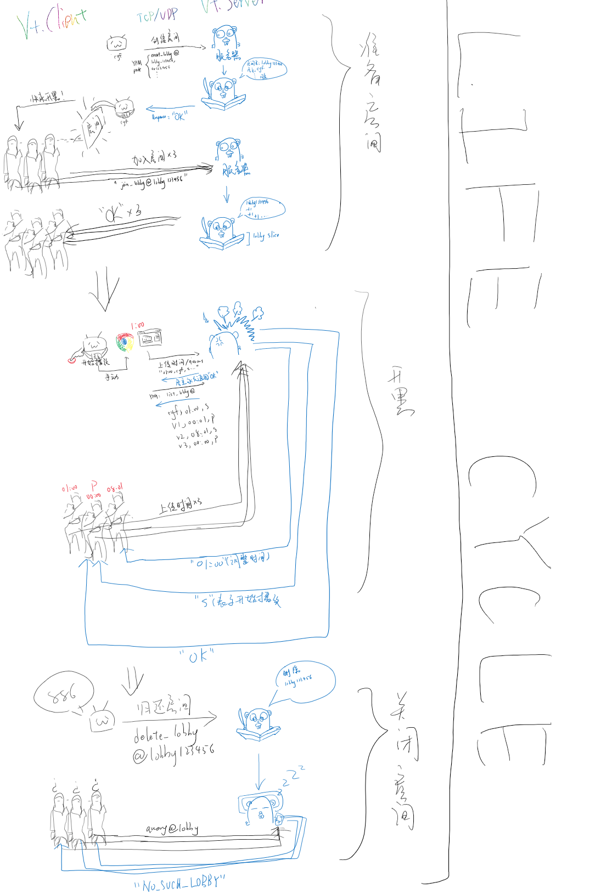

# Vt.Client
🎦 一起开黑看视频！VideoTogether Windows客户端 .Net Framework Winform

QQ测试开发群请加：1033072739


## 0 事由

### 0.1 在起初...

之前和雨季一起在b站一起看g总的时候，苦恼于如何云开黑看视频，但市面上居然没有一款符合这种要求的软件。无奈之下只好开直播，然后看直播的放送，这有几个问题。

### 0.2 直播的缺点

1. 你需要一台能放直播的电脑，配置要求得过得去。
2. 直播需要实名制，如果你没有验证过，你就得等等。
3. 你必须关心直播的电脑工作是否正常，因为除了你之外没有人知道这台电脑工作是否正常。
4. 画质再怎么说都没有原生浏览器播放的好。
5. 对网络上行有要求。
6. 直播间的卡顿仍旧会造成你和直播实际的延迟。

### 0.3 手动同步的缺点

我们还尝试过手动同步，这又有如下缺点：

1. 网络状态不同，卡顿后就会造成不同步。
2. 需要时不时口头询问拨放到哪里了，来确认是否同步。
3. 手动同步十分困难。

于是乎这就成为了我编写VideoTogether的动机。我简称为Vt。

### 0.4 Vt相比之的优点

Vt有如下优点：

1. 无需担心的同步，一切由服务器的同步算法完成。
2. 精确至最大误差为2-5秒（可设置）的同步。
3. 可共享的登录状态（避免观众中有人没有大会员却需要观看大会员资源的尴尬情况）。
4. 干净的界面（去除各种b站广告）。

未开发/正在开发的功能请关注项目网址或群内。

## 1 使用说明

### 1.1 主界面

#### 昵称

第一次打开请先修改名称。建议使用英文字母，汉字尚未测试。

只需输入名字就会自动更改。控件失去焦点时保存到本地。

#### 登陆视频网站

如果你需要使用共享登陆状态的功能，请先登录。

点击 登陆视频网站 -> 哔哩哔哩 并进行扫码登录或是输入登录，等待浏览器自动关闭并提示登陆成功。

如果中途关闭浏览器可能会产生短时间的卡顿，尚未修复。（20/1/24）

----

接下来介绍菜单栏项目。

### 1.1 新建 

#### 1.1.1 房间

房间名，密码必填项，不累述。

##### 视频URL

形如

```
https://www.bilibili.com/video/av12345
https://www.bilibili.com/bangumi/ss12345
```

##### 最大可接受同步偏差

也就是房间内其他人与房主视频位置最大偏差值。

例如你选择2秒，则当有人比你快或者慢大于不等于两秒时，他就会进行视频进度调整。

##### 共享登录状态

你的登录Cookie登录状态将会被共享给其他人，通常使用于某些人无法观看大会员视频的情况。如果担心Cookie的安全问题，可以考虑自搭服务器或者每次看完视频都进行注销操作。

### 1.2 服务器

#### 1.1.2 选择

用于选择不同的服务器，详情请见 高级配置 一章。

#### 1.1.3 测试当前

当前服务器工作正常时，将提示OK对话框。

## 2 工作流程（Workflow）



随手画了一张。;D